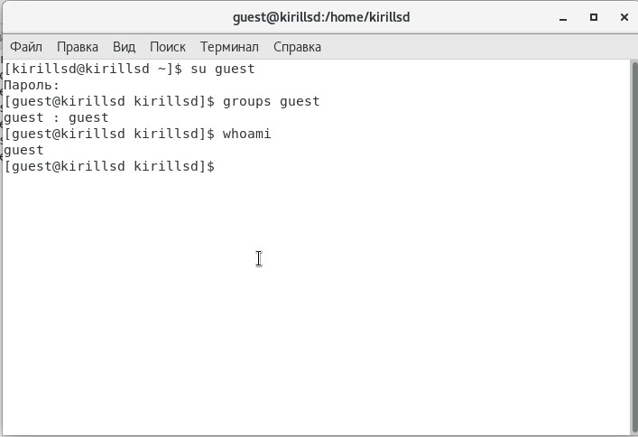
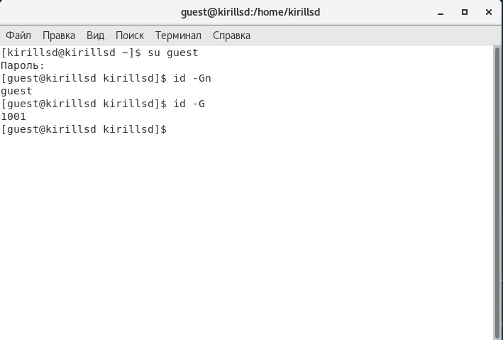
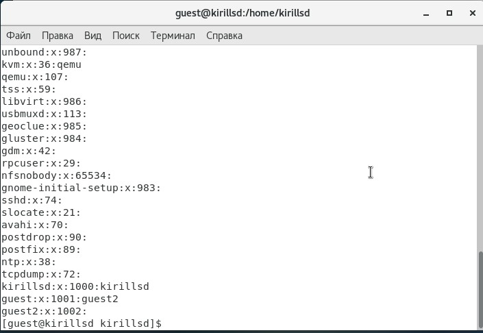
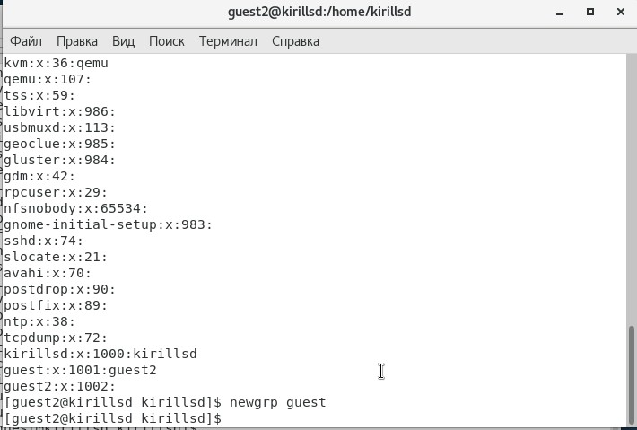

---
## Front matter
lang: ru-RU
title: Лабораторная работа №3
author: |
	Сидоракин
institute: |
	 RUDN University, Moscow, Russian Federation
date: Сентябрь, 2021 Москва

## Formatting
toc: false
slide_level: 2
theme: metropolis
sansfont: NotoMono-Regular
header-includes: 
 - \metroset{progressbar=frametitle,sectionpage=progressbar,numbering=fraction}
 - '\makeatletter'
 - '\beamer@ignorenonframefalse'
 - '\makeatother'
aspectratio: 43
section-titles: true
---
## Цель лабораторной работы

Получение практических навыков работы в консоли с атрибутами файлов для групп пользователей

# Процесс выполнения лабораторной работы

## Создаю учетную запись пользователя guest

{ #fig:001 width=50% }

## Задаю пароль для пользователя guest

{ #fig:002 width=50% }

## Создаем второго пользователя

{ #fig:003 width=50% }

## Добавляем пользователя guest2 в группу guest

{ #fig:004 width=70% }

## Осуществляем вход в систему от двух пользователей

{ #fig:005 width=70% }

## Второй пользователь

{ #fig:006 width=70% }

## Определяем директории пользователей

{ #fig:007 width=70% }

## Определяем директории пользователей

{ #fig:008 width=70% }

## Сравнение информации /etc/group

{ #fig:009 width=50% }

{ #fig:010 width=50% }

{ #fig:009 width=50% }

{ #fig:009 width=50% }

## Просматриваем файл "/etc/passwd/".

{ #fig:010 width=50% }

## Просматриваем файл "/etc/passwd/".

{ #fig:009 width=50% }

## Регистрируем guest2

{ #fig:011 width=50% }

## Изменяем права директории

{ #fig:012 width=50% }

## Снимаем атрибуты с директории

{ #fig:013 width=50% }

## Минимально необходимые права для выполнения операций

{ #fig:017 width=50% }

## Вывод
Мы приобрели практические навыки работы в консоли с атрибутами файлов, закрепели теоретические основы дискреционного разграничения доступа в современных системах с открытым кодом на базе ОС Linux.