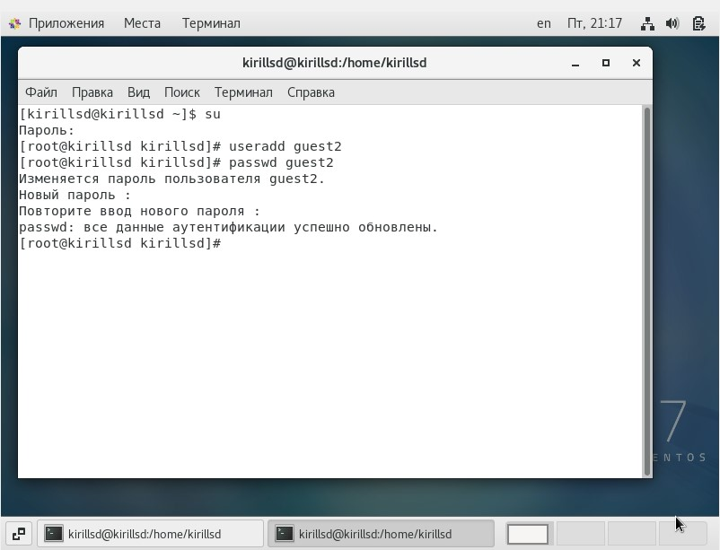
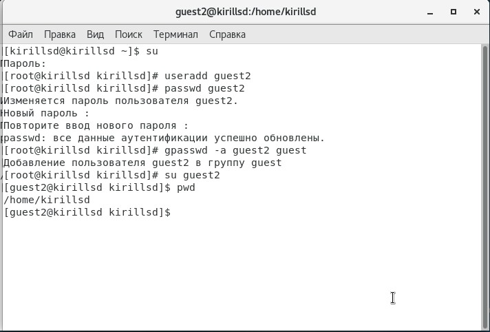
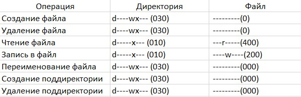

---
# Front matter
title: "Лабораторнаяработа № 3"
subtitle: "Дискреционное разграничение прав в Linux. Два пользователя"
author: "Сидоракин Кирилл Вячеславович НБибд-02-18"

# Generic otions
lang: ru-RU
toc-title: "Содержание"

# Bibliography
bibliography: bib/cite.bib
csl: pandoc/csl/gost-r-7-0-5-2008-numeric.csl

# Pdf output format
toc: true # Table of contents
toc_depth: 2
lof: true # List of figures
lot: true # List of tables
fontsize: 12pt
linestretch: 1.5
papersize: a4
documentclass: scrreprt
## I18n
polyglossia-lang:
  name: russian
  options:
	- spelling=modern
	- babelshorthands=true
polyglossia-otherlangs:
  name: english
### Fonts
mainfont: PT Serif
romanfont: PT Serif
sansfont: PT Sans
monofont: PT Mono
mainfontoptions: Ligatures=TeX
romanfontoptions: Ligatures=TeX
sansfontoptions: Ligatures=TeX,Scale=MatchLowercase
monofontoptions: Scale=MatchLowercase,Scale=0.9
## Biblatex
biblatex: true
biblio-style: "gost-numeric"
biblatexoptions:
  - parentracker=true
  - backend=biber
  - hyperref=auto
  - language=auto
  - autolang=other*
  - citestyle=gost-numeric
## Misc options
indent: true
header-includes:
  - \linepenalty=10 # the penalty added to the badness of each line within a paragraph (no associated penalty node) Increasing the value makes tex try to have fewer lines in the paragraph.
  - \interlinepenalty=0 # value of the penalty (node) added after each line of a paragraph.
  - \hyphenpenalty=50 # the penalty for line breaking at an automatically inserted hyphen
  - \exhyphenpenalty=50 # the penalty for line breaking at an explicit hyphen
  - \binoppenalty=070 # the penalty for breaking a line at a binary operator
  - \relpenalty=050 # the penalty for breaking a line at a relation
  - \clubpenalty=150 # extra penalty for breaking after first line of a paragraph
  - \widowpenalty=150 # extra penalty for breaking before last line of a paragraph
  - \displaywidowpenalty=50 # extra penalty for breaking before last line before a display math
  - \brokenpenalty=010 # extra penalty for page breaking after a hyphenated line
  - \predisplaypenalty=10000 # penalty for breaking before a display
  - \postdisplaypenalty=0 # penalty for breaking after a display
  - \floatingpenalty = 20000 # penalty for splitting an insertion (can only be split footnote in standard LaTeX)
  - \raggedbottom # or \flushbottom
  - \usepackage{float} # keep figures where there are in the text
  - \floatplacement{figure}{H} # keep figures where there are in the text
  - \usepackage{rotating}
  - \usepackage{tabularx}
---

# Цель работы

Получение практических навыков работы в консоли с атрибутами файлов для групп пользователей

# Выполнение лабораторной работы

В установленной операционной системе создаем учётную запись пользователя guest

{ #fig:001 width=50% }

Задаем пароль для пользователя guest

{ #fig:002 width=50% }

Аналогичные действия выполняем для пользователя guest2

{ #fig:003 width=50% }

Добавляем пользователя guest2 в группу guest: gpasswd -a guest2 guest

{ #fig:004 width=50% }

Осуществите вход в систему от двух пользователей

{ #fig:005 width=50% }
{ #fig:006 width=50% }

Для обоих пользователей определяем директорию

{ #fig:007 width=50% }
{ #fig:008 width=50% }

Уточняем имя пользователя и группу

{ #fig:009 width=50% }
{ #fig:010 width=50% }

Сравниваем вывод команд groups с выводом команд id -Gn и id -G

{ #fig:001 width=50% }
{ #fig:012 width=50% }

Сравниваем полученную информацию с содержимым файла "/etc/group"

{ #fig:013 width=50% }
{ #fig:014 width=50% }

От имени пользователя guest2 выполняем регистрацию пользователя guest2 в группе guest 
{ #fig:015 width=50% }

От имени пользователя guest изменяем права директории "/home/guest"

{ #fig:016 width=50% }

От имени пользователя guest снимаем с директории "/home/guest/dir1" все атрибуты

{ #fig:017 width=50% }

Минимально необходимые права для выполнения операций

{ #fig:017 width=50% }

# Вывод

Мы приобрели практические работы в консоли с атрибутами файлов для групп пользователей